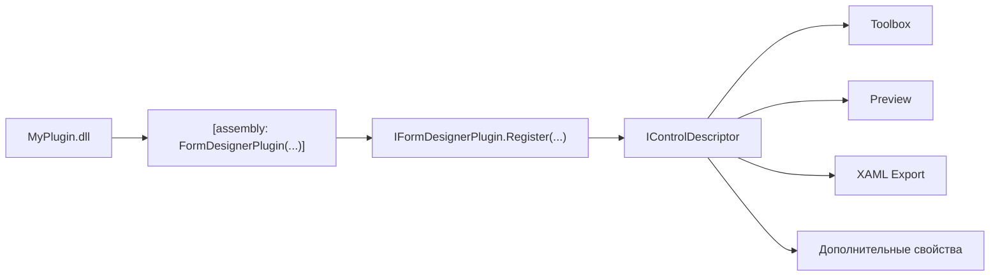
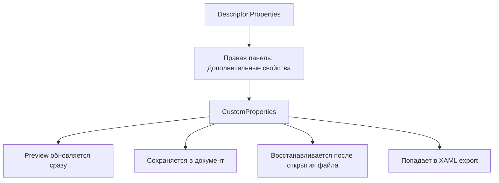

# Гайд по созданию плагинов для FormDesigner

Этот документ дополняет встроенную справку и показывает полный путь: как сделать свой plugin control, добавить ему свойства, preview и XAML-экспорт, а потом загрузить его в редактор.

## Что такое плагин

Плагин в `FormDesigner` — это отдельная `.dll`, которая:

- регистрирует один или несколько контролов через `IFormDesignerPlugin`
- описывает контролы через `IControlDescriptor`
- строит preview на дизайнерской поверхности
- экспортирует контрол в XAML
- добавляет descriptor-driven свойства в правую панель

## Общая схема



## Где смотреть рабочий пример

В проекте уже есть готовый демо-плагин:

- `D:\Проекты\FormDesigner\Plugins\DemoDesignerPlugin\DemoPluginPackage.cs`
- `D:\Проекты\FormDesigner\Plugins\DemoDesignerPlugin\Descriptors\DemoGridControlDescriptor.cs`
- `D:\Проекты\FormDesigner\Plugins\DemoDesignerPlugin\Descriptors\DemoTreeListDescriptor.cs`
- `D:\Проекты\FormDesigner\Plugins\DemoDesignerPlugin\Controls\DemoGridControl.cs`
- `D:\Проекты\FormDesigner\Plugins\DemoDesignerPlugin\Controls\DemoTreeList.cs`

Если нужен ориентир по enum-свойствам и `CustomProperties`, лучше всего смотреть `DemoGridControlDescriptor`.

## Шаг 1. Создайте проект плагина

Обычно это отдельная `Class Library` на `net7.0`.

Минимум, который нужен:

```xml
<Project Sdk="Microsoft.NET.Sdk">
  <PropertyGroup>
    <TargetFramework>net7.0</TargetFramework>
    <Nullable>enable</Nullable>
    <OutputPath>..\..\bin\$(Configuration)\net7.0\Plugins\MyPlugin\</OutputPath>
  </PropertyGroup>

  <ItemGroup>
    <PackageReference Include="Avalonia" Version="11.3.12" />
  </ItemGroup>

  <ItemGroup>
    <ProjectReference Include="..\..\PluginContracts\FormDesigner.PluginContracts.csproj" />
  </ItemGroup>
</Project>
```

Важно:

- `OutputPath` лучше сразу направлять в `bin\...\Plugins\MyPlugin\`
- тогда после сборки редактор сможет найти плагин при следующем запуске

## Шаг 2. Добавьте пакет плагина

Пакет — это входная точка плагина.

```csharp
using FormDesigner.PluginContracts;

[assembly: FormDesignerPlugin(typeof(MyPlugin.MyPluginPackage))]

namespace MyPlugin;

public sealed class MyPluginPackage : IFormDesignerPlugin
{
    public string Id => "My.Plugin";
    public string Title => "My Plugin";
    public Version ApiVersion => new(1, 0, 0);

    public void Register(IDesignerRegistry registry)
    {
        registry.RegisterControl(new MyCardDescriptor(Id, "1.0.0"));
        registry.RegisterControl(new MyChartDescriptor(Id, "1.0.0"));
    }
}
```

Что здесь важно:

- атрибут `[assembly: FormDesignerPlugin(...)]`
- реализация `IFormDesignerPlugin`
- регистрация descriptor-ов через `registry.RegisterControl(...)`

## Шаг 3. Создайте descriptor

Descriptor — это сердце плагина. Он описывает:

- как контрол называется в toolbox
- в какой категории он лежит
- какие свойства видит пользователь
- как строится preview
- как контрол экспортируется в XAML

Скелет:

```csharp
using Avalonia.Controls;
using FormDesigner.PluginContracts;

public sealed class MyCardDescriptor : IControlDescriptor
{
    public string TypeKey => "My.Card";
    public string Title => "My Card";
    public string Category => "My Plugins";
    public string Description => "Карточка с заголовком и акцентом.";
    public bool IsContainer => false;
    public bool CanHostChildren => false;
    public string ChildLayoutMode => "Absolute";

    public IReadOnlyList<DesignPropertyDescriptor> Properties => PropertySchema;

    public DesignerControlDefinition CreateDefaultDefinition(IDescriptorContext context)
    {
        var definition = new DesignerControlDefinition
        {
            TypeKey = TypeKey,
            DescriptorId = TypeKey,
            PluginId = "My.Plugin",
            PluginVersion = "1.0.0"
        };

        definition.BuiltInProperties["Width"] = 320d;
        definition.BuiltInProperties["Height"] = 180d;
        definition.BuiltInProperties["Background"] = "#0F172A";
        definition.CustomProperties["Caption"] = "\"Новая карточка\"";
        definition.CustomProperties["AccentBrush"] = "\"#60A5FA\"";

        return definition;
    }

    public Control BuildPreview(IDesignControlNode control, IPreviewContext context)
    {
        throw new NotImplementedException();
    }

    public void AppendXaml(IXamlWriter writer, IDesignControlNode control, int indentLevel, IXamlExportContext context)
    {
        throw new NotImplementedException();
    }
}
```

## Шаг 4. Опишите свойства

Правая панель теперь умеет строить дополнительный блок свойств из `descriptor.Properties`.

Сейчас поддержаны редакторы:

- `Text`
- `Bool`
- `Number`
- `Color`
- `Enum`

Пример схемы:

```csharp
private static readonly IReadOnlyList<DesignPropertyDescriptor> PropertySchema = new[]
{
    new DesignPropertyDescriptor
    {
        Key = "Caption",
        Title = "Заголовок",
        Category = "Content",
        Editor = PropertyEditorKind.Text,
        DefaultValueJson = "\"Новая карточка\""
    },
    new DesignPropertyDescriptor
    {
        Key = "AccentBrush",
        Title = "Акцент",
        Category = "Appearance",
        Editor = PropertyEditorKind.Color,
        DefaultValueJson = "\"#60A5FA\""
    },
    new DesignPropertyDescriptor
    {
        Key = "ShowBadge",
        Title = "Показывать бейдж",
        Category = "Behavior",
        Editor = PropertyEditorKind.Bool,
        DefaultValueJson = "true"
    },
    new DesignPropertyDescriptor
    {
        Key = "HeaderStyle",
        Title = "Стиль шапки",
        Category = "Appearance",
        Editor = PropertyEditorKind.Enum,
        DefaultValueJson = "\"Classic\"",
        Options = new[]
        {
            new PropertyOption { Value = "Classic", Title = "Classic" },
            new PropertyOption { Value = "Compact", Title = "Compact" },
            new PropertyOption { Value = "Analytics", Title = "Analytics" }
        }
    }
};
```

## Built-in свойства и CustomProperties

Есть два основных пути.

### 1. Built-in свойства

Используйте их, если хотите работать через стандартные поля редактора.

Примеры:

- `Width`
- `Height`
- `Background`
- `BorderBrush`
- `Opacity`
- `IsVisible`

Такие значения хранятся в `BuiltInProperties`.

### 2. CustomProperties

Используйте их для plugin-specific настроек:

- стиль шапки
- акцентный цвет
- режим отображения
- внутренние флаги поведения

Такие значения хранятся в `CustomProperties` как JSON.

Схема:



## Шаг 5. Постройте preview

Preview — это обычный `Avalonia Control`, который создается из данных модели.

Пример:

```csharp
public Control BuildPreview(IDesignControlNode control, IPreviewContext context)
{
    return new MyCardControl
    {
        Width = control.GetDouble("Width", 320),
        Height = control.GetDouble("Height", 180),
        Background = Brush.Parse(control.GetString("Background", "#0F172A")),
        Caption = control.GetCustomValue("Caption", "Новая карточка"),
        AccentBrush = control.GetCustomValue("AccentBrush", "#60A5FA"),
        ShowBadge = control.GetCustomValue("ShowBadge", true),
        HeaderStyle = control.GetCustomValue("HeaderStyle", "Classic")
    };
}
```

Практический совет:

- делайте preview устойчивым к пустым значениям
- всегда задавайте fallback-значения
- если контрол работает с данными, предусмотрите sample-preview

## Шаг 6. Добавьте XAML-экспорт

Если не реализовать `AppendXaml`, контрол будет красиво выглядеть в дизайнере, но не сможет полноценно экспортироваться.

Пример:

```csharp
public void AppendXaml(IXamlWriter writer, IDesignControlNode control, int indentLevel, IXamlExportContext context)
{
    context.RegisterXmlNamespace(
        "my",
        "clr-namespace:MyPlugin.Controls;assembly=MyPlugin");

    writer.WriteLine(indentLevel,
        $"<my:MyCardControl x:Name=\"{control.Name}\" " +
        $"Width=\"{control.GetDouble(\"Width\", 320)}\" " +
        $"Height=\"{control.GetDouble(\"Height\", 180)}\" " +
        $"Caption=\"{control.GetCustomValue(\"Caption\", \"Новая карточка\")}\" " +
        $"HeaderStyle=\"{control.GetCustomValue(\"HeaderStyle\", \"Classic\")}\" />");
}
```

## Шаг 7. Если контрол работает с данными

Для data-aware контролов есть несколько вариантов:

### DataGrid / TreeList style

Если ваш контрол должен работать как таблица:

- добавьте `BindingSourceId` в built-in или custom свойства
- используйте `context.GetBindingSource(bindingSourceId)` в preview и export
- учитывайте, что в дизайнере лучше показывать структуру, а не весь реальный набор строк

### Plugin control со своими данными

Если контрол хранит свою внутреннюю коллекцию:

- можно описать ее через `Collection`
- либо хранить схему в `CustomProperties`
- либо сделать смешанную модель: `BindingSourceId` + custom display options

## Шаг 8. Как загрузить плагин в редактор

Редактор ищет плагины в:

- `AppContext.BaseDirectory\Plugins`

То есть практический путь такой:

1. Собрали плагин.
2. Получили `.dll` и зависимости.
3. Положили их в папку `Plugins\MyPlugin\`.
4. Перезапустили редактор.
5. Новый контрол появился в toolbox.

## Как редактор находит плагин

Реальная логика загрузки находится в:

- `D:\Проекты\FormDesigner\DesignerSystem\Infrastructure\PluginLoading.cs`
- `D:\Проекты\FormDesigner\App.axaml.cs`

Что происходит:

- при старте приложения вызывается `PluginLoader`
- loader сканирует все `.dll` в папке `Plugins`
- ищет `[FormDesignerPlugin]` и/или типы, реализующие `IFormDesignerPlugin`
- создает экземпляр пакета
- вызывает `Register(...)`
- descriptors попадают в реестр и становятся видны в UI

## Что уже можно делать через descriptor-driven свойства

Сейчас для plugin controls уже работает следующий цикл:

1. свойство описано в `descriptor.Properties`
2. пользователь меняет его в блоке `Дополнительные свойства`
3. значение уходит в `CustomProperties`
4. preview обновляется сразу
5. документ сохраняется
6. после открытия файла значение восстанавливается

Это уже видно на demo plugin controls.

## Практический шаблон структуры плагина

```text
MyPlugin/
  MyPlugin.csproj
  MyPluginPackage.cs
  Controls/
    MyCardControl.cs
    MyChartControl.cs
  Descriptors/
    MyCardDescriptor.cs
    MyChartDescriptor.cs
```

## Мини-чеклист перед первой сборкой

- есть `ProjectReference` на `FormDesigner.PluginContracts`
- у сборки есть `[assembly: FormDesignerPlugin(...)]`
- реализован `IFormDesignerPlugin`
- зарегистрирован хотя бы один `IControlDescriptor`
- в descriptor есть `CreateDefaultDefinition`
- в descriptor есть `BuildPreview`
- в descriptor есть `AppendXaml`
- схема `Properties` описана осмысленно
- `OutputPath` ведет в папку `Plugins`

## Если контрол не появился в toolbox

Проверьте по порядку:

1. Собралась ли `.dll` без ошибок.
2. Лежит ли она реально в `bin\...\Plugins\...`.
3. Есть ли у сборки атрибут `FormDesignerPlugin`.
4. Реализует ли пакет `IFormDesignerPlugin`.
5. Вызывается ли `registry.RegisterControl(...)`.
6. Перезапущен ли редактор.
7. Нет ли проблем с зависимостями рядом с `.dll`.

## Если дополнительные свойства не работают

Обычно проблема одна из этих:

- `Key` в `Properties` не совпадает с ключом в `CustomProperties`
- значение записано не как JSON
- preview читает другое имя свойства
- `AppendXaml` забыли синхронизировать с preview

## Рекомендованный первый plugin control

Если делаете плагин впервые, не начинайте с очень сложного контейнера.

Лучший первый вариант:

- кастомная кнопка
- карточка
- панель статуса
- таблица с 2-3 enum и color свойствами

После этого уже переходите к:

- сложным data controls
- контейнерам
- редакторам коллекций
- вложенным plugin-компонентам

## Что смотреть в demo plugin прямо сейчас

Самый полезный маршрут по исходникам:

1. `D:\Проекты\FormDesigner\Plugins\DemoDesignerPlugin\DemoPluginPackage.cs`
2. `D:\Проекты\FormDesigner\Plugins\DemoDesignerPlugin\Descriptors\DemoDevButtonDescriptor.cs`
3. `D:\Проекты\FormDesigner\Plugins\DemoDesignerPlugin\Descriptors\DemoGridControlDescriptor.cs`
4. `D:\Проекты\FormDesigner\Plugins\DemoDesignerPlugin\Descriptors\DemoTreeListDescriptor.cs`
5. `D:\Проекты\FormDesigner\Plugins\DemoDesignerPlugin\Controls\DemoGridControl.cs`

Этого уже достаточно, чтобы собрать свой первый рабочий плагин.
